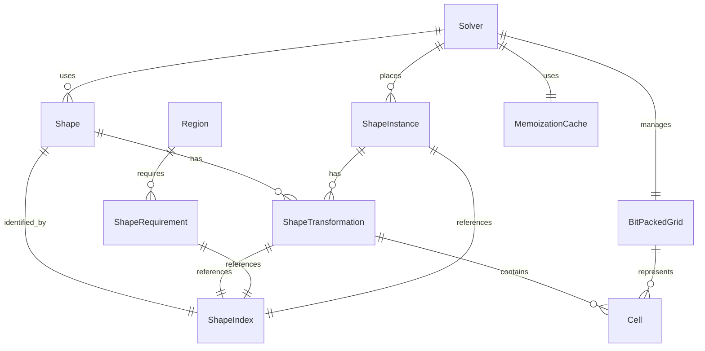

# Data Model: Day12 Performance Optimization

**Date**: 2025-12-17
**Branch**: 001-day12-optimization
**Status**: Phase 1 - Complete

## Core Domain Entities

### Shape

Represents a Christmas present shape with all possible orientations.

```rust
#[derive(Debug, Clone, PartialEq, Eq, Hash)]
pub struct Shape {
    pub index: ShapeIndex,
    pub cells: Vec<Cell>,           // Normalized cell coordinates (0,0) origin
    pub width: usize,              // Bounding box width
    pub height: usize,             // Bounding box height
    pub transformations: Vec<ShapeTransformation>,  // All unique orientations
}

#[derive(Debug, Clone, Copy, PartialEq, Eq, Hash)]
pub struct ShapeIndex(pub usize);

#[derive(Debug, Clone, Copy, PartialEq, Eq, Hash)]
pub struct Cell {
    pub x: usize,
    pub y: usize,
}

#[derive(Debug, Clone, PartialEq, Eq, Hash)]
pub struct ShapeTransformation {
    pub shape_index: ShapeIndex,
    pub cells: Vec<Cell>,
    pub width: usize,
    pub height: usize,
    pub bit_pattern: u64,          // Bitmask for fast collision detection
}
```

**Key Design Decisions**:
- Pre-compute all transformations to avoid runtime rotation costs
- Include bit pattern for ultra-fast overlap detection
- Store bounding box dimensions for quick bounds checking
- Use newtypes to prevent coordinate/dimension confusion

### BitPackedGrid

High-performance grid representation using 64-bit words.

```rust
#[derive(Debug, Clone)]
pub struct BitPackedGrid {
    pub cells: Vec<u64>,           // Bit-packed grid cells
    pub width: usize,
    pub height: usize,
    pub words_per_row: usize,      // Pre-computed for efficiency
}

#[derive(Debug, Clone, Copy, PartialEq, Eq)]
pub struct GridPosition {
    pub x: usize,
    pub y: usize,
}

impl BitPackedGrid {
    // Core operations with inline optimizations
    #[inline] pub fn is_occupied(&self, pos: GridPosition) -> bool
    #[inline] pub fn set_occupied(&mut self, pos: GridPosition, occupied: bool)
    #[inline] pub fn can_place_transformation(&self, trans: &ShapeTransformation, pos: GridPosition) -> bool
    #[inline] pub fn place_transformation(&mut self, trans: &ShapeTransformation, pos: GridPosition)
    #[inline] pub fn remove_transformation(&mut self, trans: &ShapeTransformation, pos: GridPosition)
}
```

**Key Design Decisions**:
- 64-bit word packing for 64x memory density improvement
- Inline methods for zero-abstraction overhead
- Pre-computed row layout for fast addressing
- Fast bulk operations using bit manipulation

### Region

Represents a tree region requiring specific shapes to be placed.

```rust
#[derive(Debug, Clone)]
pub struct Region {
    pub dimensions: RegionDimensions,
    pub shape_requirements: Vec<ShapeRequirement>,
    pub total_cells: usize,        // Pre-computed area
}

#[derive(Debug, Clone, Copy, PartialEq, Eq)]
pub struct RegionDimensions {
    pub width: usize,
    pub height: usize,
}

#[derive(Debug, Clone, PartialEq, Eq)]
pub struct ShapeRequirement {
    pub shape_index: ShapeIndex,
    pub count: usize,
    pub required_area: usize,      // Pre-computed total area
}
```

**Key Design Decisions**:
- Pre-compute area calculations for pruning
- Separate shape requirements from shape definitions
- Support for multiple instances of each shape

### ShapeInstance

Represents a specific shape that needs to be placed during solving.

```rust
#[derive(Debug, Clone)]
pub struct ShapeInstance {
    pub shape_index: ShapeIndex,
    pub transformations: Vec<ShapeTransformation>,
    pub placement_options: usize,   // Cached number of valid positions
}
```

**Key Design Decisions**:
- Cache placement count for intelligent ordering
- Store reference to transformations to avoid duplication
- Designed for dynamic reordering during search

### Solver State

Manages the optimization search with memoization and pruning.

```rust
#[derive(Debug)]
pub struct Solver {
    pub shapes: Vec<Shape>,                     // All shape definitions
    pub grid: BitPackedGrid,                   // Current grid state
    pub instances: Vec<ShapeInstance>,         // Shapes to place
    pub cache: MemoizationCache,               // Subproblem results
    pub hasher: ZobristHasher,                 // Fast state hashing
}

#[derive(Debug)]
pub struct MemoizationCache {
    pub cache: HashMap<u64, bool>,             // Grid hash -> solvable result
    pub max_size: usize,                       // Memory limit
}

#[derive(Debug)]
pub struct ZobristHasher {
    pub table: Vec<u64>,                      // Random hash table
}
```

**Key Design Decisions**:
- Separation of concerns between grid and search logic
- Memoization cache with size limits for memory control
- Zobrist hashing for fast incremental state updates

## Entity Relationships



## Validation Rules

### Shape Validation
- All shapes must have at least one occupied cell
- Shape cells must be normalized (minimum x,y = 0)
- Transformations must be unique (no duplicates)
- All transformations must fit within reasonable bounds

### Grid Validation
- Grid dimensions must be positive and within limits (e.g., 20x20 max)
- Grid coordinates must be within bounds
- Bit pattern operations must not overflow

### Region Validation
- Region dimensions must match available shapes
- Shape requirements must be non-negative
- Total required area must not exceed region area
- All required shapes must be defined

### Solver Validation
- Initial grid state must be empty
- All shape instances must correspond to valid shapes
- Cache size must be reasonable (e.g., < 1M entries)

## State Transitions

### Shape Processing Pipeline
1. **Parse** raw shape definition → Shape with basic cells
2. **Normalize** cell coordinates → Shape with normalized cells
3. **Generate** all rotations/flips → Shape with transformations
4. **Deduplicate** similar transformations → Shape with unique transformations
5. **Cache** bit patterns → Shape ready for solver

### Search Algorithm Flow
1. **Initialize** empty grid and shape instances
2. **Order** instances by constraint level (min-fit heuristic)
3. **Recurse** with backtracking and pruning
4. **Memoize** subproblem results
5. **Terminate** when solution found or all options exhausted

### Grid State Changes
- **Place**: Set bits in grid for shape cells
- **Remove**: Clear bits for shape cells (backtrack)
- **Check**: Test bit overlap using AND operations
- **Hash**: Incremental Zobrist hash updates

## Performance Considerations

### Memory Layout
- Shape data stored contiguously for cache efficiency
- Grid operations use 64-bit aligned access
- Cache entries use compact hash maps

### Algorithmic Complexity
- **Grid operations**: O(1) with bit operations
- **Shape placement**: O(cells) with early termination
- **Memoization lookup**: O(1) average case
- **Overall search**: Dramatically reduced through pruning

### Hot Path Optimizations
- All grid operations are inline and use bit manipulation
- Shape transformations are pre-computed
- Placement options are cached for ordering
- Hash updates are incremental

## Error Handling Strategy

### Parse Errors
- Invalid shape format → `ParseError::InvalidShapeFormat`
- Invalid region dimensions → `ParseError::InvalidDimensions`
- Invalid shape counts → `ParseError::InvalidCounts`

### Runtime Errors
- Out of bounds access → panic (logic error)
- Cache overflow → warning + cache reset
- Invalid placement → panic (logic error)

### Result Types
```rust
pub type ParseResult<T> = Result<T, ParseError>;
pub type SolveResult = bool;  // true = solvable, false = unsolvable

#[derive(Debug, thiserror::Error)]
pub enum ParseError {
    #[error("Invalid shape format: {0}")]
    InvalidShapeFormat(String),
    #[error("Invalid region dimensions: {0}")]
    InvalidDimensions(String),
    #[error("Invalid shape counts: {0}")]
    InvalidCounts(String),
}
```

## Testing Strategy

### Unit Tests
- Shape parsing and normalization
- Transformation generation and deduplication
- Grid operations (place, remove, check)
- Bit pattern correctness

### Integration Tests
- Complete region solving with known results
- Performance benchmarks against reference implementation
- Memory usage validation

### Property Tests
- Transformation invariants (rotations are reversible)
- Grid state consistency (place/remove are inverses)
- Hash collision resistance
- Cache correctness

This data model provides the foundation for a high-performance implementation while maintaining clarity, type safety, and adherence to Rust best practices.